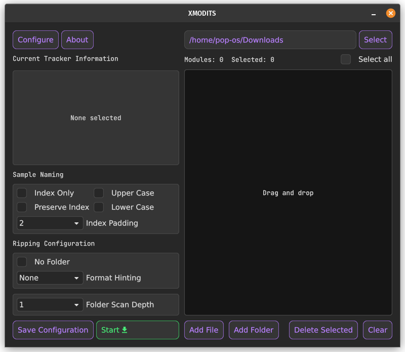
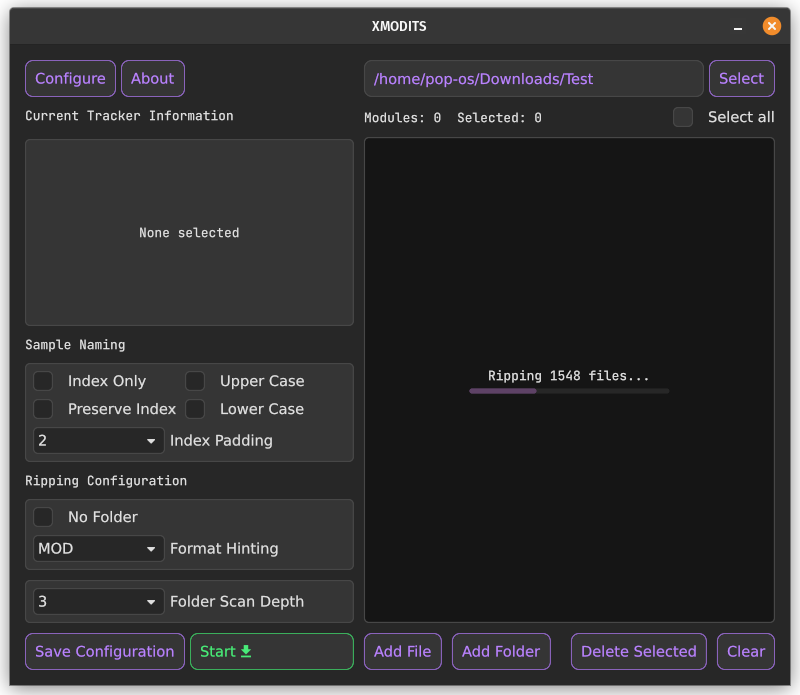

<div align="center">

 
<!-- I could do with an improved logo tbh -->

# XMODITS - A fast & lightweight tool to extract samples from tracker music.
<!-- [](https://github.com/B0ney/xmodits/actions/workflows/rust.yml) -->
</div>

## Supported Formats
| Extension | Format |
| --- | --- |
| IT | Impulse Tracker |
| XM | Extended Module | 
| S3M | Scream Tracker 3 |
| MOD | Amiga Pro Tracker |
| MPTM | ModPlug Tracker module |
| UMX | Unreal Music Package (Containing above) |

## GUI Screenshot
 
<!--  -->

## CLI Screenshot
Soon

## Download
Soon

## Download
You can download builds for xmodits [here](https://github.com/B0ney/xmodits/releases).

If you wish to build from source, go to [building](#building).

<!-- ## Other projects:
* xmodits cli application
* xmodits python library -->

## How to Use (GUI)
**Windows Only**

If you want to simply extract samples, you can just drag and drop a module(s) onto the binary. Xmodits will (by default) place the samples in a self contained folder in your ```~/Downloads``` folder.

**All Platforms**

### Sample Naming
<!-- Configures how ripped samples are named -->

|||
|--|--|
| Index Only | Samples will only be named with an index |
| Preserve Index | Sample index will match how it's represented internally. |
| Upper Case | Samples will be named in upper case.|
| Lower Case | Samples will be named in lower case.|
| Index Padding | Pad index with preceding zeros.<br>Set to 1 to remove padding.|


### Ripping Configuration

|||
|--|--|
| No Folder | Xmodits will not put samples in a self contained folder.<br>This can overwrite data so use with caution.|
|Format Hinting| Tell xmodits which format to load first, instead of relying on the file extension.|
| Folder Scan Depth | Limit how far a folder can be traversed. |

### Saving Configuration
Any changes made to the configuration must be saved manually.<br>The configuration file can be located at:

windows:
```%appdata%\xmodits\```

Linux:
```~/.config/xmodits/```


## How to Use (CLI version)
Note: On Windows, the CLI binary has been renamed to "xmodits-cli.exe"

```
xmodits <module path> [destination folder]

e.g:
    xmodits ./test.s3m ~/Music/Samples/

e.g: 
    xmodits ./test.s3m

e.g:
    xmodits ./mod1.mod ./mod2.it ./mod3.s3m [destination folder]

e.g: (linux only)
    xmodits ./*.mod ~/Downloads
```
If the destination is not provided, xmodits will place the ripped samples in a self contained folder in the current working directory.

### Additional Arguments
If you want to customize how ripped samples are named, the following arguments can be used:

|short| long| Description|
|--|--|--|
|-i |--index-only| Ripped samples will only be named with an index.|
|-r |--index-raw| Preserve internal sample indexing.|
|-p |--index-padding| Pad sample index with preceding zeros. 0-1 will disable padding.|
|-n |--no-folder| Do not create a new folder for ripped samples.<br>This can overwrite data, BE CAREFUL!|
|-u |--upper| Name samples in upper case. |
|-l |--lower| Name samples in lower case. |
||--hint| Hint xmodits to load a particular format first.<br>```[it, xm, s3m, mod, umx, mptm]```|
||--info| Print information about a tracker module. |


<!-- ## Note
The purpose of this tool (the core) is to dump samples that's it.

You'll notice some dumped samples may not sound identical to what's heard in a tracker module. 

This is because the tracker authour has applied effects such as pitch increase, vibrato.

Replicating these effects is not a top priority.  -->

## Resources
The resources that made this project possible can be found [here](./resources/).

## Building
Requirements:
* Rust compiler: https://www.rust-lang.org/tools/install
* Minimum rust version: 1.65

### Building the GUI
```
cargo build -p xmodits-gui --release
```
### Building the CLI
```
cargo build -p xmodits --release
```

## Licenses
The xmodits project has multiple programs. Each with their own licenses.

|Program| License|
|--|--|
|[XMODITS-GUI](app/gui/) (App) | GPLv3|
|[XMODITS-CLI](app/cli/) (App) | LGPLv3 |
|[XMODITS-PY](pylib/) (basically xmodits-cli)| LGPLv3 |
|XMODITS-LIB | MPLv2 |

## Special Thanks
- The GUI was made with [Iced](https://github.com/iced-rs/iced)
- [@0x192](https://github.com/0x192) (and contributers) for their [Universal Android Debloat tool](https://github.com/0x192/universal-android-debloater/). I've learned a lot of gui stuff from that project.
