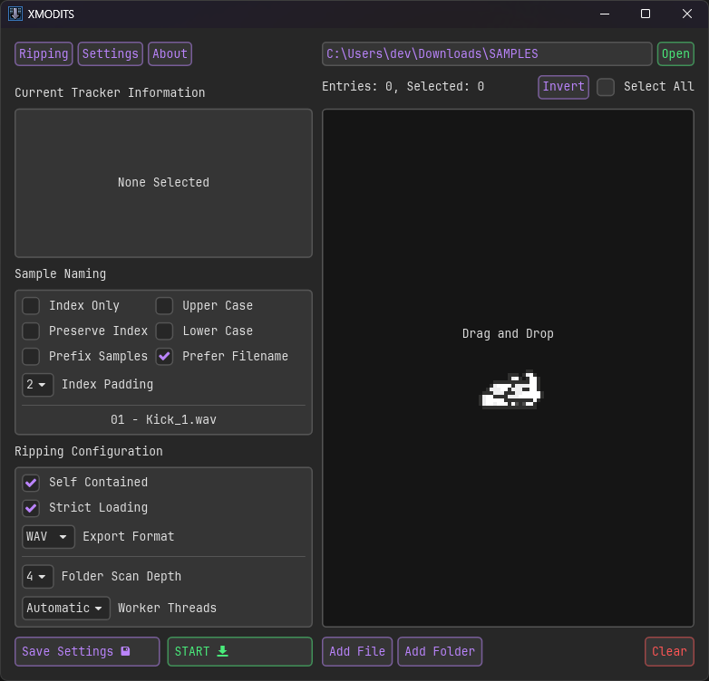

<div align="center">
     
<!-- I could do with an improved logo tbh -->

# XMODITS


# A tool to bulk extract samples from various tracker modules with ease.
</div>
<div align="center">


[](https://github.com/B0ney/xmodits/releases)
[](https://github.com/B0ney/xmodits/releases.atom)

</div>

<div align="center">
<a href="https://github.com/iced-rs/iced">
  
</a>
</div>

## Download
You can download builds for xmodits [here](https://github.com/B0ney/xmodits/releases).

If you wish to build from source, go to [building](#building).

If you prefer to use a minimal version of this tool, a command line version of xmodits can be found [here](https://github.com/B0ney/xmodits-cli). Additionally, the command line version has more supported architectures. 

## Supported Tracker Formats
| Extension | Format | 
| - | - |
| ``.it`` | Impulse Tracker* |
| ``.xm`` | Extended Module | 
| ``.s3m`` | Scream Tracker 3 |
| ``.mod`` | Amiga Pro Tracker |
| ``.mptm`` | ModPlug Tracker module* |
| ``.umx`` | Unreal Music Package (Containing above) |

\* Ripping from OpenMPT trackers is not pefect 

# Supported Exports
| Extension | Format |
|-|-|
|``.wav``| Microsoft Wave|
|``.aiff``| Audio Interchange File Format |
|``.its``| Impulse Tracker 2 sample |
|``.s3i``| Scream Tracker 3 Instrument |
|``.8svx``| 8-Bit Sampled Voice |
|``.raw``| Headerless pcm |

## Features
<!-- * Sample previewing  (0.12.0)-->
* A robust naming system for extracted samples (see [Sample Naming](#sample-naming)).
* Can export samples to less common audio formats used by music trackers: ``.its``, ``.s3i`` & ``.8svx``
* Can show information about a module.
* Multithreaded ripping* for better efficiency.
* Cute animated fox to make ripping less tedious.
<!-- * Resuming -->
<!-- * History -->

\* xmodits will only use threads if it is ripping from a directory.

## Screenshots

<details>
<summary>Click to show more</summary>


Click [here](./assets/screenshots/README.md) for different themes

</details>

## How to Use
(**Windows Only**) If you just want to simply extract samples, you can just drag and drop a module(s) onto the binary. XMODITS will (by default) place the samples in a self contained folder in your ```~/Downloads``` folder.

### Sample Naming
Configure how ripped samples are named.

|Parameter| Description|
|--|--|
| ``Index Only`` | Samples will only be named with an index. |
| ``Preserve Index`` | Sample index will match how it is represented internally. |
| ``Prefix Samples`` | Samples will be prefixed with the tracker's filename. |
| ``Upper Case`` | Samples will be named in upper case.|
| ``Lower Case`` | Samples will be named in lower case.|
| ``Prefer Filename`` | Some samples have an additional filename. If present, xmodits will name samples with that. |
| ``Index Padding`` | Set the minimum amount of digits an index must have. Indexes will be padded with zeros to match the minimum amount of digits*. Set to 1 to disable padding.|

\* xmodits may override this value to ensure that samples are named consistently (unless it is set to 1).

### Ripping Configuration

|Parameter| Description|
|--|--|
| ``Self Contained`` | Xmodits will put samples in a self contained folder.|
| ``Export Format`` | Samples can be saved to the following formats: [ ``wav``, ``aiff``, ``8svx``, ``its``, ``s3i``, ``raw`` ]|
| ``Folder Scan Depth`` | Limit how far a folder can be traversed. |


### Saving Configuration
Any changes made to the configuration **must be saved manually**.<br>The configuration file can be located at:

|OS|Path|
|-|-|
|Windows|``%appdata%\xmodits\config.toml``|
|Linux|``~/.config/xmodits/config.toml``|
|MacOs|``~/Library/Application Support/xmodits/config.toml``|

## Building
Requirements:
* Rust compiler: https://www.rust-lang.org/tools/install
* Minimum rust version: 1.65
* A decent computer. 

Clone the source code:
```shell
git clone https://github.com/B0ney/xmodits
```

Build:
```shell
cd xmodits

cargo build --release
```
### Build Flags

|Feature | Description | Enabled by Default? |
|-|-|-|
|``audio``|Add audio playback, used to preview samples.|**yes**|
|``build_info``|Includes metadata about the binary and the environment it was compiled in - making it useful for bug reporting.|**yes**|
|``jemalloc``| (*nix only) Uses the [jemalloc](https://jemalloc.net/) memory allocator. Can be used to mitigate memory fragmentation which can improve memory footprint.  |no|
|``wgpu``| Enables hardware acceleration for the GUI (DX12/Vulkan/Metal). |no|

For example, to compile xmodits with ``jemalloc`` and ``wgpu``:
```shell
cargo build --features="jemalloc","wgpu"
```

Build flags used in official releases:
* audio
* build_info
* update_check
* jemalloc (linux-only)

## License
xmodits is licensed under the GPLv3

## Other xmodits projects

|Program| License|Description|
|--|--|--|
|[XMODITS-CLI](https://github.com/B0ney/xmodits-cli) | LGPLv3 | xmodits cli app|
|[XMODITS-PY](https://github.com/B0ney/xmodits-py) | LGPLv3 | xmodits Python library. [PyPi link](pypi.org/project/xmodits-py/) <br> (Mainly used for [DawVert](https://github.com/SatyrDiamond/DawVert))<br> |
|[XMODITS-LIB](https://github.com/B0ney/xmodits-lib) | MPLv2 | xmodits core library|

## Special Thanks
- The GUI was made with [Iced](https://github.com/iced-rs/iced)
- [@0x192](https://github.com/0x192) (and contributors) for their [Universal Android Debloat tool](https://github.com/0x192/universal-android-debloater/). I've learned a lot of gui stuff from that project.
- [SatyrDiamond](https://github.com/SatyrDiamond)'s [DawVert](https://github.com/SatyrDiamond/DawVert), A program to convert different daw project files to other formats. 
- The animated fox gif was obtained from: https://github.com/tonybaloney/vscode-pets